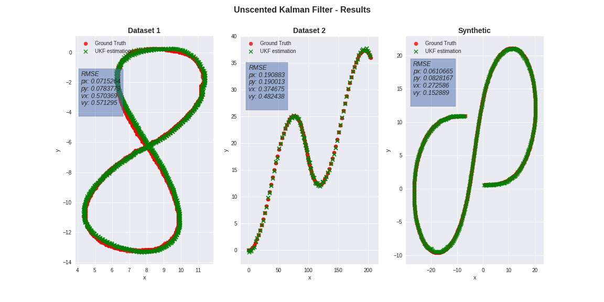
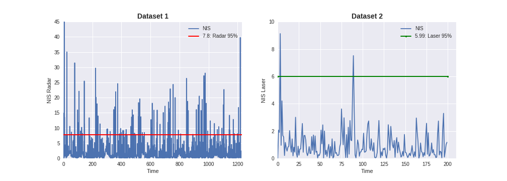

# Object Tracking with Sensor Fusion (Unscented-Kalman-Filter)

## Table Content: ##
- [Objective](#objective)
- [Results](#results)
- [How to run](#howto)
- [Difference between Kalman Filters](#filters)
- [Unscented vs Extended Kalman Filter](#vs)
- [Code](#code)
- [Discussion](#discussion)

## Objective: 

	Utilize sensor data from both LIDAR and RADAR measurements for object (e.g. pedestrian, vehicles, 
	or other moving objects) tracking with the Unscented Kalman Filter.

## Results: 

- Estimation vs Ground Truth with different data sets
 
- Nis of Data1 and Data2

## How to run: 

	Perform steps following:

	- Clone this repo: **git clone https://github.com/oucler/Unscented-Kalman-Filter.git**
	- Enter into directory: **cd ~/<repository>**
	- Make build directory: **mkdir build && cd build**
	- Compile the code: **cmake .. && make**
	- Run the code: ** ./UnscentedKF ../data/<name> <output_name> <rmse_output_name> **
	
## Difference between Kalman Filters: 

	Kalman filters have the same mains steps: 1. Initialization, 2. Prediction, 3. Update. The Prediction and Update processes can be linear and non-linear.  A Standard Kalman Filter (KF) can be used when the process is linear but when it is not there are two options: Extended and Unscented Kalman Filters.  Extended Kalman Filter uses the Jacobian matrix to linearize non-linear functions; Unscented Kalman Filter, on the other hand, does not need to linearize non-linear functions, instead, the Unscented Kalman Filter maps representative points from a Gaussian distribution.
	
## Unscented vs Extended Kalman Filter: 

	Table 1: Accuracy comparison in RMSE by using EKF and UKF with both lidar and radar measurements. The lidar and radar measurements are included in the txt file under the data folder.

|            state        |  UKF          |    EKF     |
|:-----------------------:|:-------------:|:----------:|
|            px           | **0.0610665** |  0.0954 |
|            py           | **0.0828167** |  0.0837 |
|            vx           | **0.272586**  |  0.4499  |
|            vy           | **0.152889**  |  0.4357  |

	Results from table1 indicates that UKF provide better results.
	
## Code: 
	main.cpp: Parse input file and generate outputfiles. Also, coordinates initialization, prediction, update, and rmse calculations.
	ukf.cpp: Initialization, Prediction, and Update stages were implemented here.
	tools.cpp: RMSE calculation was implemented here.	
	
## Discussion: 

	There can be couple of improvement areas: 1- Implemenentation of code can be more efficient. 2- Finding out optimal parameters that would give the best result.
	